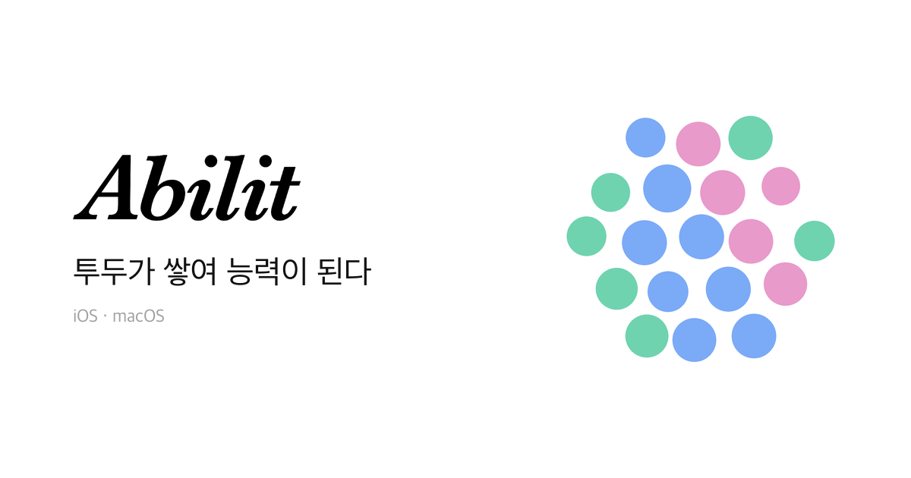
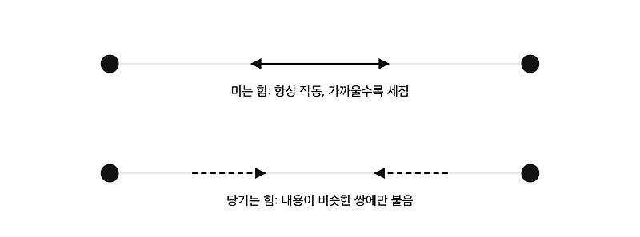
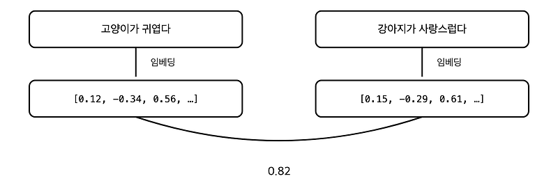
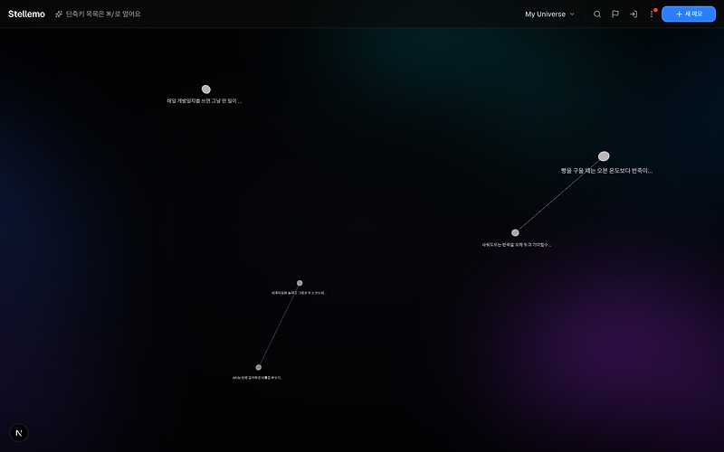
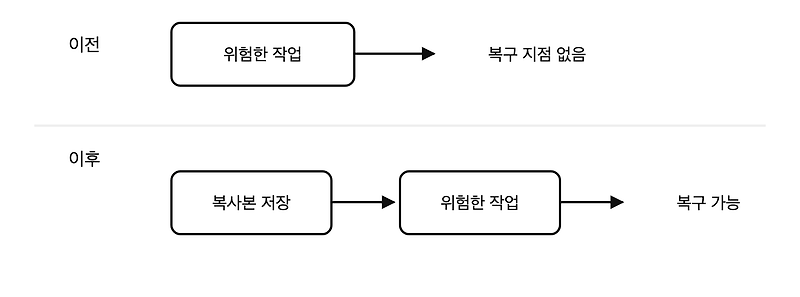
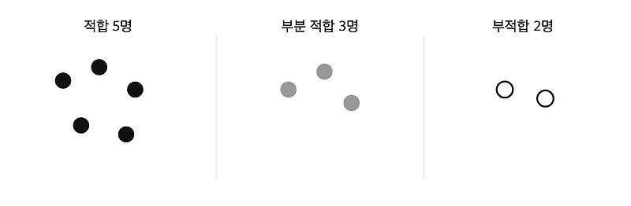
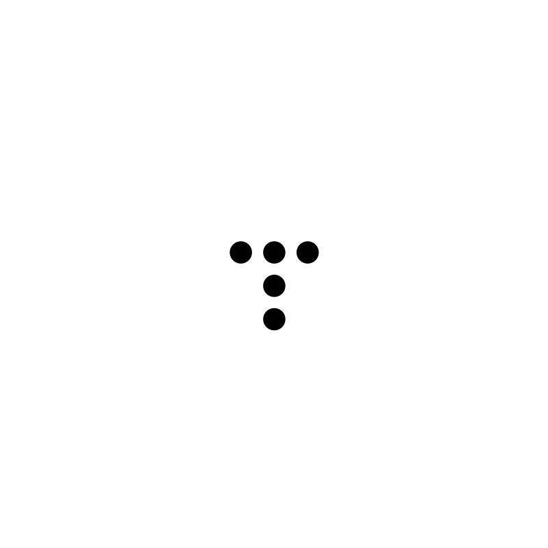
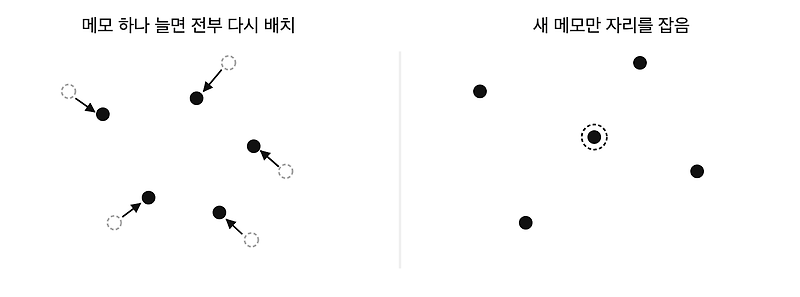
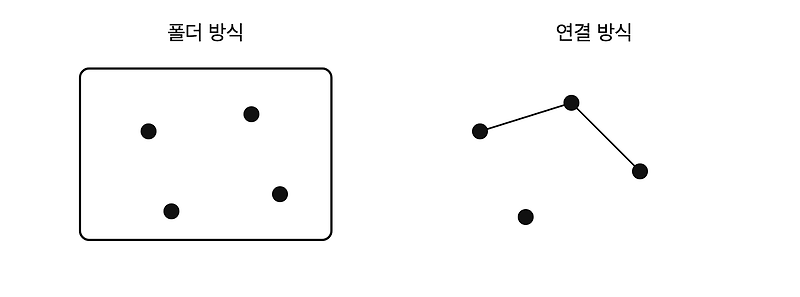

<table>
<tr>
<td width="33%"> 투두를 완료하면 내 능력과 성장이 눈에 보이기 시작합니다.</td>
<td width="33%"> 기록하고, 연결을 발견하고, 꺼내 쓰는 공간형 메모 서비스입니다.</td>
<td width="33%"></td>
</tr>
</table>

 

## 요즘 쓰는 글

<!-- BLOG-POST-LIST:START -->
<table>
<tr>
<td></td>
<td></td>
<td></td>
<td></td>
</tr>
<tr>
<td></td>
<td></td>
<td></td>
<td></td>
</tr>
</table>
<!-- BLOG-POST-LIST:END -->

[블로그](https://daco2020.tistory.com/)
